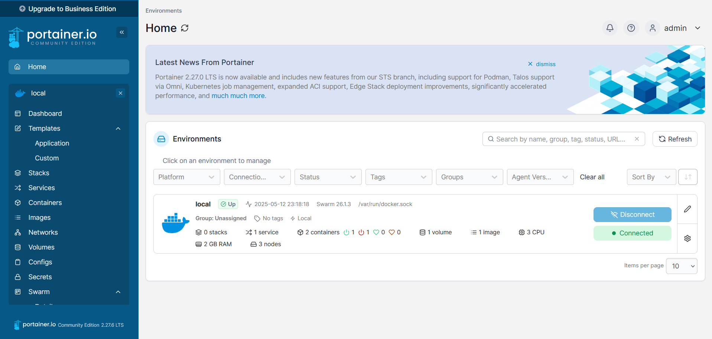

# 🐳 Vagrant + Docker Swarm Cluster (com Portainer)

Este projeto é um **fork** do repositório original do professor **Denilson Bonnati**, com melhorias voltadas para infraestrutura e visualização do cluster Docker Swarm usando o **Portainer**.

<p align="center">
  
</p>

---

## 📦 Sobre o projeto

O objetivo deste projeto é automatizar a criação de um **ambiente virtualizado com múltiplos nós** usando **Vagrant**, **VirtualBox** e **Docker Swarm**.

O cluster é composto por:

- 1 nó **master**
- 2 nós **workers**

Todos os nós são provisionados com Docker, e o nó master é responsável por inicializar o cluster Swarm.

---

## ⚙️ Tecnologias utilizadas

- [Vagrant](https://www.vagrantup.com/)
- [VirtualBox](https://www.virtualbox.org/)
- [Docker](https://www.docker.com/)
- [Docker Swarm](https://docs.docker.com/engine/swarm/)
- [Portainer](https://www.portainer.io/) (interface gráfica para gerenciamento do cluster)

---

## 📁 Estrutura do projeto

```plaintext
vagrant-swarm/
├── Vagrantfile
├── scripts/
|   ├── install_docker.sh
│   ├── init_swarm.sh
│   └── join_worker.sh
```
---
## 🚀 Inicialização

Para subir o ambiente:

```bash
vagrant up
```
Os scripts de provisionamento instalam o Docker e configuram o cluster automaticamente. O token de join é salvo em um arquivo compartilhado (/vagrant/worker_token), permitindo que os workers ingressem no cluster.

## 🌐 Acessando o Portainer

Após o provisionamento, o Portainer estará disponível em:
```
http://192.168.56.10:9000
```
---
## 🧰 Funcionalidades principais do Portainer no projeto

- 🎛️ Interface gráfica para gerenciar containers, volumes, imagens e redes
  
- 📦 Criação, escala e remoção de serviços distribuídos no Swarm
- 👥 Visualização e gerenciamento de nós do cluster
- 📊 Monitoramento de uso de recursos dos containers
- ⚙️ Deploy de stacks com arquivos docker-compose.yml
- 🔒 Controle de acesso com usuários e times


> O uso do Portainer facilita a inspeção, o aprendizado e a manutenção do cluster de forma intuitiva e segura.
---
## 📌 Observações

- As VMs utilizam IPs privados na faixa 192.168.56.0/24

- Certifique-se de que sua rede local não conflita com esses IPs

- O Portainer está configurado como um serviço replicado acessível apenas no nó master
---
## 📬 Contato

Você pode me encontrar nas seguintes plataformas:

[](https://github.com/brenda-gouveia)
[](https://www.linkedin.com/in/brenda-gomes-gouveia)
[](mailto:brendaggouveia@gmail.com)

---
## 📄Licença

Este projeto é um fork educacional e segue os termos da licença do projeto original.

